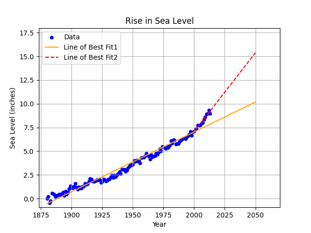

# Sea Level Predictor

## Project Description

This project predicts future sea level change through the year 2050. It uses a dataset that tracks the global average sea level rise since 1880 and applies linear regression Algorithm to forecast Future Sea Level Rise. 

This project is a solution to this **[FreeCodeCamp challenge](https://www.freecodecamp.org/learn/data-analysis-with-python/data-analysis-with-python-projects/sea-level-predictor)** , where the objective is to analyze sea level changes, create visualizations, and make predictions using Machine Learning Algorithms (Linear Regression).


## Technologies Used

This project uses several Python libraries for data manipulation, analysis, and visualization:

- **Pandas**: Used for data manipulation and importing the data.
- **Matplotlib**: Utilized to create the scatter plot.
- **Scipy**: used for linear regression, to compute the slope and the y-intercept of the line of best fit, by using the linear regression function from `scipy.stats` 
- **NumPy**: A powerful library for the numeric operations in python. 

---

## Project Structure

The project is structured as follows:

- `sea_level_predictor.py`: Contains the primary Python functions for data analysis and visualization.
- `epa-sea-level.csv`: The dataset with historical sea level data used for analysis.
- `main.py`: A script that runs the program, executes unit tests, and generates the visualizations.
- `test_module.py`: Contains unit tests to validate the functionality of the program.
- `README.md`: This file, which provides project documentation.

---
## Sample Visualizations
- The project generates a Scatter Plot with Regression Lines to predict Future Sea Level Rise


This plot displays the historical sea level rise (Year vs. Sea Level in inches),
showing the line of best fit for the entire dataset from (year-1880).
and a second line of best fit calculated from the (year-2000) , predicting future sea level rise (year-2050) based on the more recent data.

## Requirements
Ensure the following Python dependencies are installed to run the project:


- **Pandas**: For data manipulation and cleaning.
- **Matplotlib**: For creating visualizations.
- **Scipy**: For performing linear regression.
- **NumPy**: For numerical operations in python

Then run `main.py`, to run the analysis, unit tests and generate the scatter plot.

```bash
python main.py
```
